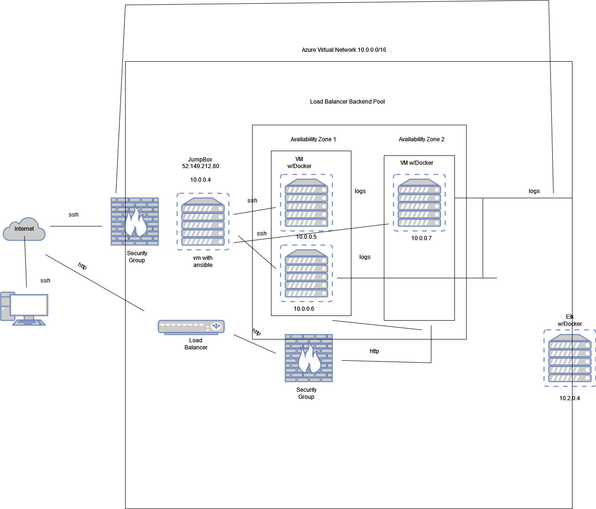

## Automated ELK Stack Deployment

The files in this repository were used to configure the network depicted below.

These files have been tested and used to generate a live ELK deployment on Azure. They can be used to either recreate the entire deployment pictured above. Alternatively, select portions of the _____ file may be used to install only certain pieces of it, such as Filebeat.

  - ---
- name: Configure Elk VM with Docker
  hosts: elk
  remote_user: azadmin
  become: true
  tasks:
    # Use apt module
    - name: Install docker.io
      apt:
        update_cache: yes
        name: docker.io
        state: present
      # Use apt module
    - name: Install pip3
      apt:
        force_apt_get: yes
        name: python3-pip
        state: present
      # Use pip module
    - name: Install Docker python module
      pip:
        name: docker
        state: present
      # Use sysctl module
    - name: Use more memory
      sysctl:
        name: vm.max_map_count
        value: "262144"
        state: present
        reload: yes
      # Use docker_container module
    - name: download and launch a docker elk container
      docker_container:
        name: elk
        image: sebp/elk:761
        state: started
        restart_policy: always
        published_ports:
          - 5601:5601
          - 9200:9200
          - 5044:5044
      # Use systemd module
    - name: Enable service docker on boot
      systemd:
        name: docker
        enabled: yes

This document contains the following details:
- Description of the Topologu
- Access Policies
- ELK Configuration
  - Beats in Use
  - Machines Being Monitored
- How to Use the Ansible Build

### Description of the Topology

The main purpose of this network is to expose a load-balanced and monitored instance of DVWA, the D*mn Vulnerable Web Application.

Load balancing ensures that the application will be highly redundant, in addition to restricting external access to the network.
- _TODO: What aspect of security do load balancers protect? 
They protect against Distributed Denial of Service (DDoS) attacks.  
What is the advantage of a jump box?_
	The jump box is a secure server that admins can first connect to before connecting to highly sensetive servers or untrusted environments.

Integrating an ELK server allows users to easily monitor the vulnerable VMs for changes to the _____ and system _____.
- _TODO: What does Filebeat watch for?_
	It watches for log data/files and forwards them to either Elastisearch or Logstash for indexing 
- _TODO: What does Metricbeat record?_
	It records metrics, satistics and services running on the server

The configuration details of each machine may be found below.
_Note: Use the [Markdown Table Generator](http://www.tablesgenerator.com/markdown_tables) to add/remove values from the table_.

| Name     | Function | IP Address | Operating System |
|----------|----------|------------|------------------|
| Jump Box | Gateway  | 10.0.0.4   | Linux            |
| Web 1     |VM           | 10.0.0.5  | |
| Web 2     |VM          | 10.0.0.6  | 
| ELK           | Server     |  10.2.0.4  |                  

### Access Policies

The machines on the internal network are not exposed to the public Internet. 

Only the _____ machine can accept connections from the Internet. Access to this machine is only allowed from the following IP addresses:
- _TODO: Add whitelisted IP addresses_

Machines within the network can only be accessed by _____.
- _TODO: Which machine did you allow to access your ELK VM? JumpBox VM What was its IP address?_52.149.212.80

A summary of the access policies in place can be found in the table below.

| Name     | Publicly Accessible | Allowed IP Addresses |
|----------|---------------------|----------------------|
| Jump Box | Yes                           | 10.0.0.4    |
| Elk      | Yes / No            | 10.2.0.4:5601/My personal IP:9601 |
|          |                     |                      |

### Elk Configuration

Ansible was used to automate configuration of the ELK machine. No configuration was performed manually, which is advantageous because...
- _TODO: What is the main advantage of automating configuration with Ansible?_
	It's a repeatable provisioning tool and it's output is less vunerable to human error

The playbook implements the following tasks:
- _TODO: In 3-5 bullets, explain the steps of the ELK installation play. E.g., install Docker; download image; etc._
- ...Configure ELK VM with Docker 

- ...Install Docker.io

-... Install pip3

-...Install Docker python moduel - module is used to control docker containers

-...Use more memory - expand the amount of memory for the container

-... Download and launch a docker elk container - 

-...Enable service docker on boot

The following screenshot displays the result of running `docker ps` after successfully configuring the ELK instance.

### Target Machines & Beats
This ELK server is configured to monitor the following machines:
- _TODO: List the IP addresses of the machines you are monitoring_
	10.0.0.5 and 10.0.0.6

We have installed the following Beats on these machines:
- _TODO: Specify which Beats you successfully installed_
	I successfully installed Filebeat and Metricbeat

These Beats allow us to collect the following information from each machine:
- _TODO: In 1-2 sentences, explain what kind of data each beat collects, and provide 1 example of what you expect to see. E.g., `Winlogbeat` collects Windows logs, which we use to track user logon events, etc._
	Filebeat collects log events and forwards them to Elastisearch or Logstash for indexing. Metricbeat collects metrics and statistics and ships them to the output that you would specify such as Elastisearch or Logstash

### Using the Playbook
In order to use the playbook, you will need to have an Ansible control node already configured. Assuming you have such a control node provisioned: 

SSH into the control node and follow the steps below:
- Copy the _____ file to _____.
- Update the _____ file to include...
- Run the playbook, and navigate to ____ to check that the installation worked as expected.

_TODO: Answer the following questions to fill in the blanks:_
- _Which file is the playbook? ansible-playbook.yml Where do you copy it? /etc/ansible/hosts
- _Which file do you update to make Ansible run the playbook on a specific machine? The # inventory which is the etc/ansible/hosts file How do I specify which machine to install the ELK server on versus which to install Filebeat on?_Modify the header of the ansible playbook to specify the different groups of machines. 
- _Which URL do you navigate to in order to check that the ELK server is running? http://[10.2.0.4]:5601/app/kibana

_As a **Bonus**, provide the specific commands the user will need to run to download the playbook, update the files, etc._
